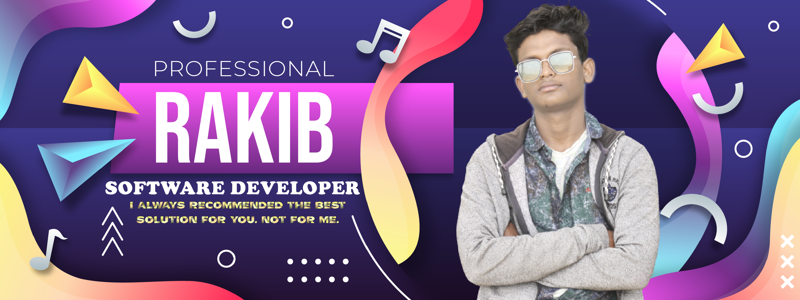

<!-- banner image starts here  -->

<!-- banner image ends here  -->

<h1> 👋 Hello, I'm Md Abdur Rakib </h1>

I am a full stack software engineer and a mobile app developer.   

<!-- Contact me section starts here  -->

 
 

<!-- Contact me section ends here  -->

<!-- about-me section starts here  -->

### 👨‍🏫 &nbsp; About Me

I am Rakib a full-stack developer with more than 5 years of experience in both designing, developing and programming websites & web applications using these technologies: (Java, Kotlin, WordPress, Shopify, PHP, Laravel, Woocommerce, Angular, React, Node, MongoDB) We have built ✅1500+ websites, web applications and ✅500+ App Develop for a broad range of industries from small and mid-level businesses to high-end companies & still counting... 🎯My aim has always been to build a website and app that looks professional.

 
<!-- about-me section ends here  -->

<!-- web related skills section starts here  -->

### 👨🏽‍💻 &nbsp; My Skills & Videos:

#### Key Skills on Web & Android App development:

 
 
 
 
 
 

<!-- other skills and my videos for computer science section starts here  -->

<!-- work experience section starts here  -->

### 💼 &nbsp; Employment History

| Position            | Institute                                   | Duration            | Location           |
| ------------------- | ------------------------------------------- | ------------------- | ------------------ |
| Full-stack trainer  | Integrify                                   | Aug 2022 - Running  | Mirpur,   BD       |
| Software Engineer   | M-Files                                     | Nov 2021 - Feb 2022 | Dhaka,    BD       |
| Cleaner (Part-time) | COOR Oy                                     | Mar 2020 - Nov 2021 | Dhaka,    BD       |
| Courier (Part-time) | Posti Oy                                    | Oct 2019 - Running  | Dhaka,    BD       |
| Research Assistant  | Tampere University                          | Nov 2020 - Jan 2021 | Dhaka,    BD       |
| Lecturer of ICT     | Jaflong Valley Boarding School              | Jul 2018 – Nov 2018 | Dhaka,    BD       |
| Guest Lecturer      | Sylhet Engineering College                  | Nov 2017 – Apr 2018 | Dhaka,    BD       |
| Android developer   | United Computer & Technical Training Center | Nov 2016 – Nov 2017 | Dhaka,    BD       |
| Lecturer of ICT     | Zhingabari High School & College            | May 2016 – Aug 2017 | Dhaka,    BD       |
|                                                                                                              |

 
<!-- work experience section ends here  -->
<!-- education section starts here  -->

### 👨🏻‍🎓 &nbsp; Education

1. M.Sc. in Software, Web & Cloud  
   Tampere University  
   Tampere, Finland.
2. B.Sc. in Computer Science & Engineering  
   Leading University  
   Thakurgaon, Bangladesh.
3. Professional Diploma in Travel & Tourism  
    London School of Commerce & IT  
   London, England.

 

<!-- education section ends here  -->

<!-- my languages section starts here  -->

### Languages:

- 🇧🇩 Bangla : Native
- 🏴󠁧󠁢󠁥󠁮󠁧󠁿 English : Advanced
- 🇮🇳 Hindi : Intermediate
- 🇧🇷 Portugues : Basic
   

<!-- my languages section ends here  -->

<!-- my sports and game section starts here  -->

### Sports / Game / Activities / Hobby:

- 🏏 Cricket, ⚽ Football, 🏸 Badminton, ♟️ Chess, 🏐 Volleyball
- 🏊‍♂️ Swimming, 🏃‍♂️ Running, 🚶‍♂️ Walking
- ✈️ Travelling

 
<!-- my sports and games section ends here  -->

---

Thanks for going through my Portfolio.
All rights reserved by Md Abdur Rakib @2022

---

<!-- my achievement section ends here  -->

<!-- Links section starts here -->

[website]: http://www.mdabdurrakib.com/
[facebook]: https://www.facebook.com/tscmdabdurrakib/
[linkedin]: https://www.linkedin.com/in/tscmdabdurrakib/

<!-- web related playlists starts here  -->

<!-- Links section ends here -->
